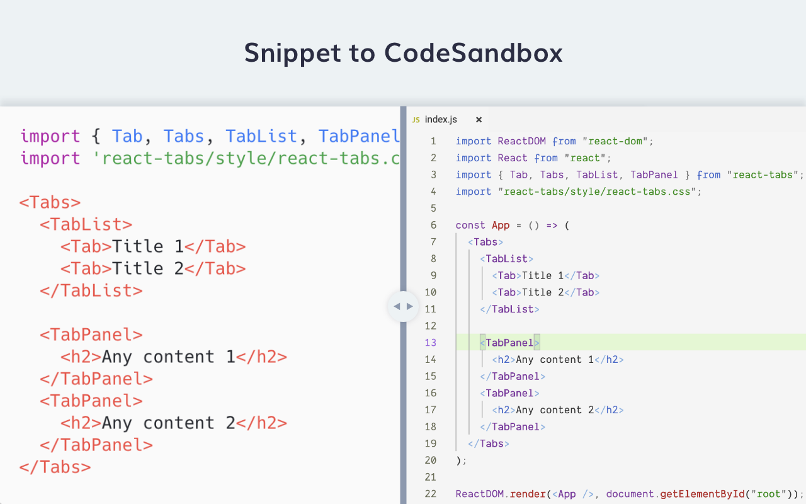
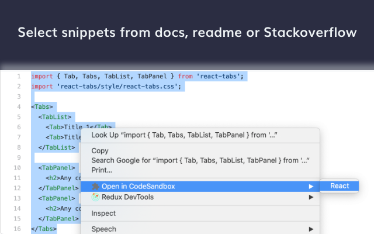

# Snippet to CodeSandbox Extension

Generate Codesandbox from text snippets.

## Install

<!-- TODO: Add Link here -->

Chrome extension link

## How it works

## Motivation

Testing any new package involves copying the code present in Readme docs of the package and place it on Codesandbox or the local environment. If in local environment we also need to install the package. But not all the docs are same, some docs just add the import statement and the JSX expression on how to use and some just add the whole DOM Rendering Logic which involves the user to adjust the code according to his use.

These process doesnt take alot of time but it becomes frustrating when testing a number of packages which does the same job. These extension will help from all these effort and just create a CodeSandbox to test and see the package in action.

### Framework and Library Supports ✨

-   [x] React
-   [ ] Vanilla - Needs Tests and a proper testing.
-   [ ] Svelte
-   [ ] Vue
-   [ ] Angular
-   [ ] Node and its frameworks

### Contributing 💻

Contribution are highly appreciated. Do read [Contributing Guide](/CONTRIBUTING.md) before starting.

### Thanks

A big thanks to [CodeSandbox](https://codesandbox.io) for providing the API to create sandbox and giving life to these extension.
